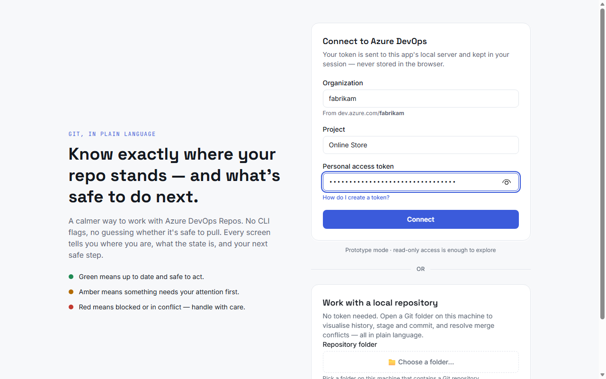
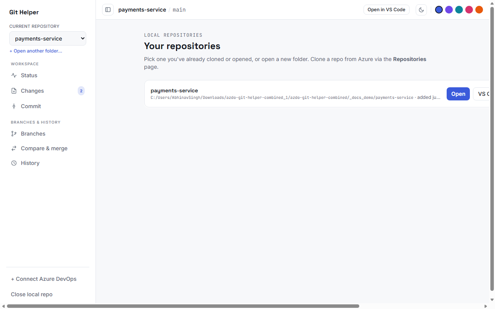
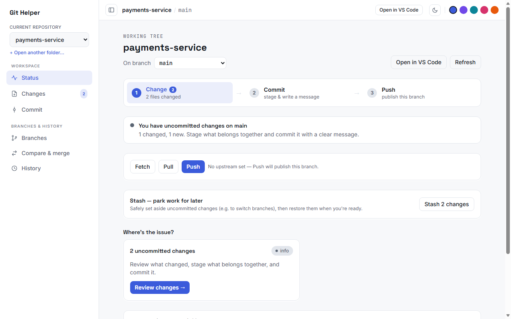
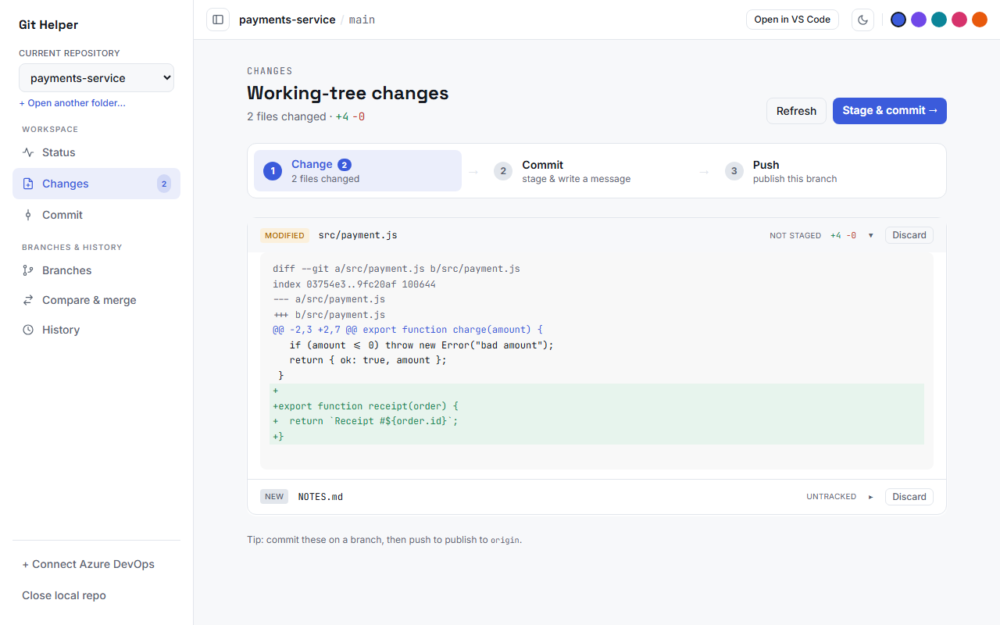
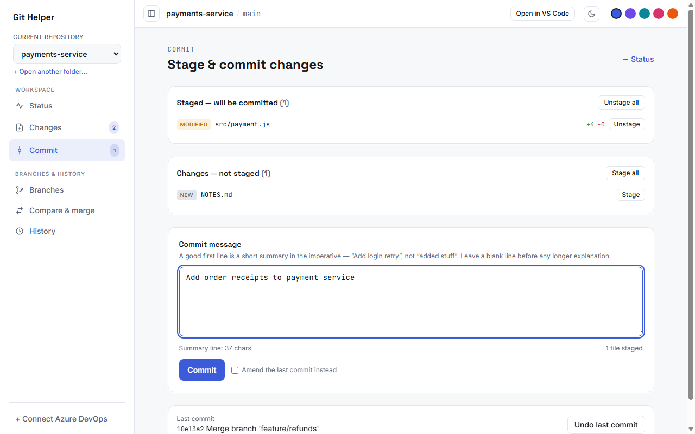
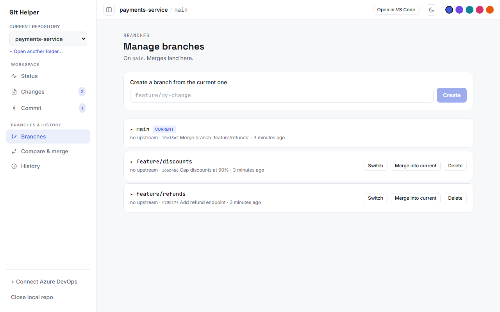
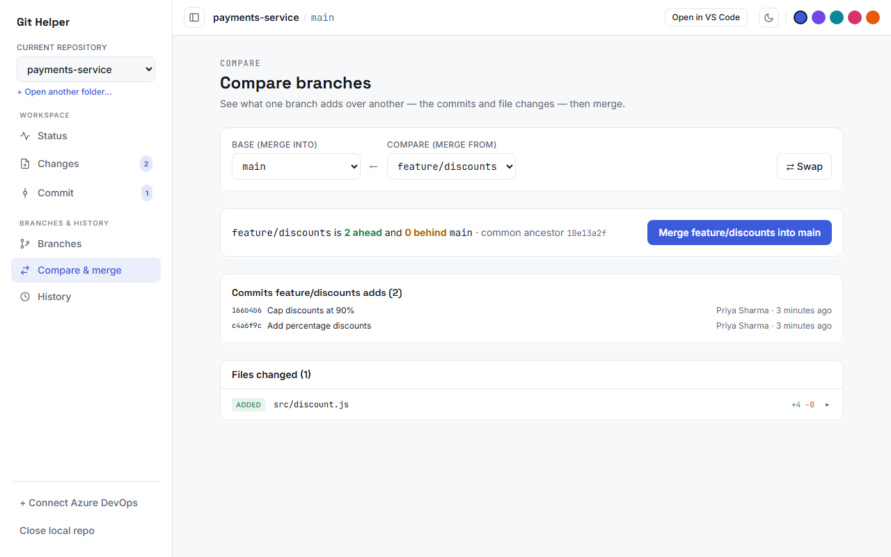
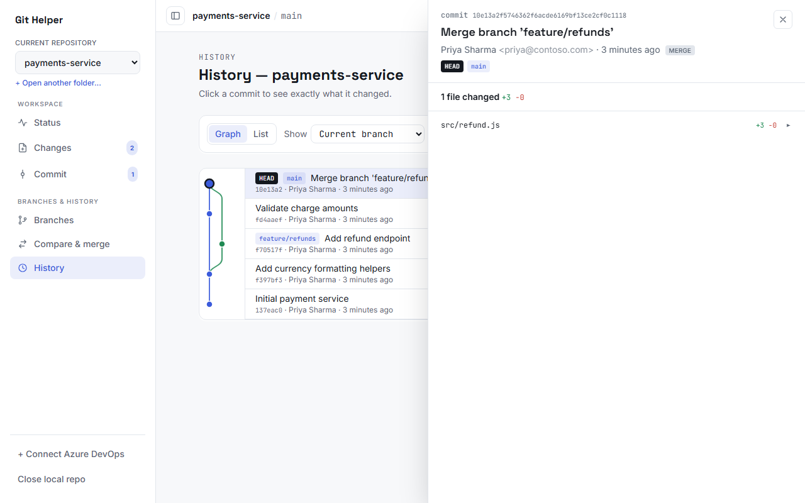
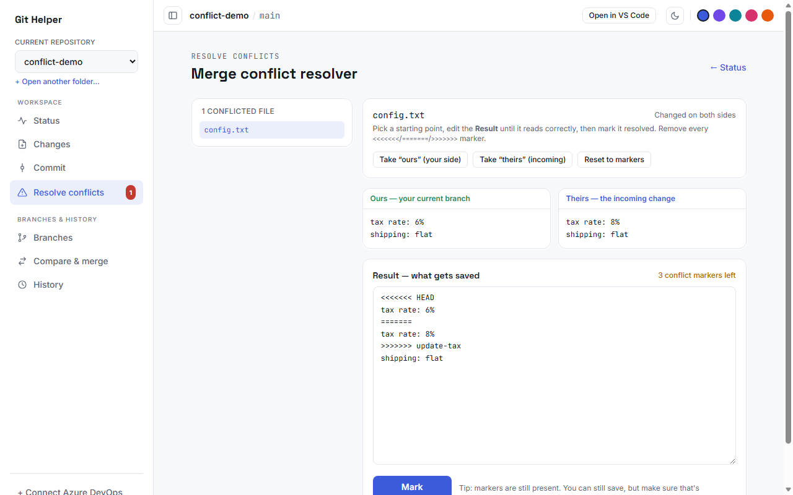
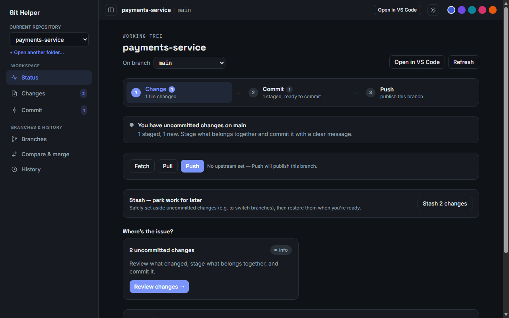

# Git Helper — User Guide

Git Helper is a friendly Git client for **Azure DevOps**. It explains your repo's
state in plain language, shows the next safe step, and covers the whole loop:
**connect → clone → change → commit → push → pull request** — without the Git CLI.

> **Get the app:** download the installer for Windows or macOS from the
> [latest release](https://github.com/Abhialphavima007/Git-Helper/releases/latest),
> or run it from source (`npm run dev` → http://localhost:5173).
> First launch on Windows: **More info → Run anyway**; on macOS: **right-click → Open**.

---

## Contents

1. [Connect to Azure DevOps](#1-connect-to-azure-devops)
2. [Clone a repository](#2-clone-a-repository)
3. [Your repositories](#3-your-repositories)
4. [Status — your home screen](#4-status--your-home-screen)
5. [Changes — review what you did](#5-changes--review-what-you-did)
6. [Commit — save your work](#6-commit--save-your-work)
7. [Branches](#7-branches)
8. [Compare & merge](#8-compare--merge)
9. [History](#9-history)
10. [Resolve merge conflicts](#10-resolve-merge-conflicts)
11. [Stash — park work for later](#11-stash--park-work-for-later)
12. [Push, Pull, Fetch](#12-push-pull-fetch)
13. [Azure DevOps cloud features](#13-azure-devops-cloud-features)
14. [Appearance: dark mode & colors](#14-appearance-dark-mode--colors)
15. [AI assistant](#15-ai-assistant)
16. [Auto-commit](#16-auto-commit)
17. [Troubleshooting](#17-troubleshooting)

---

## 1. Connect to Azure DevOps

When the app opens without a connection you land on the **Connect** screen.

Fill in three things:

| Field | What to enter |
|---|---|
| **Organization** | The name after `dev.azure.com/` in your browser — e.g. for `dev.azure.com/fabrikam` enter `fabrikam` |
| **Project** | The project name exactly as it appears in Azure DevOps |
| **Personal access token** | A PAT — see below |

**Creating a PAT** (one time): in Azure DevOps click your avatar (top right) →
**User settings → Personal access tokens → New Token**. Give it a name, pick your
organization, and under **Scopes** choose **Code → Read & write** (read-only is
enough for browsing, but cloning private repos, pushing, and completing pull
requests need write). Copy the token and paste it into the app.

Your token is kept in an **encrypted session cookie on your machine** — it is
never stored in the browser or sent anywhere except Azure DevOps.

Press **Connect**. The sidebar now shows the **Azure DevOps** section
(Dashboard, Repositories, Branches, Compare branches, Pull requests).

> Prefer to work without Azure? Use **Work with a local repository** below the
> form — pick any Git folder on your machine and skip to
> [Status](#4-status--your-home-screen).

### Connecting later, and disconnecting

You don't have to connect right away — the two modes are independent:

- **+ Connect Azure DevOps** (bottom of the sidebar) — if you started with a
  local repository only, click this any time to open the Connect screen and add
  the Azure side. Both sections then live together in the sidebar, and cloning
  from [Repositories](#2-clone-a-repository) becomes available.
- **Disconnect Azure** (bottom of the sidebar) — signs you out and forgets the
  token for this session. Your local repositories are untouched.
- **Close local repo** — deselects the current local repository (it stays in
  [Your repositories](#3-your-repositories) for one-click reopening).

The connection lasts for your session (about 8 hours) — after that, just
connect again with the same PAT until the token itself expires.

---

## 2. Clone a repository

1. In the sidebar under **Azure DevOps**, open **Repositories**.
2. Every repo in your project is listed. Click **Clone to local** on the one you want.
3. A dialog asks **where** to put it — click **Choose…** to browse your disk
   (you can jump between drives, go **Up**, or **Home**), then **Clone here**.
4. A **progress bar appears at the top** of the app while Git downloads
   (`Receiving objects… 45%`).
5. When it finishes, the repo **opens automatically** in the local workspace —
   you land on [Status](#4-status--your-home-screen), already wired to Azure as
   its `origin`.

You only ever clone a repo **once** — after that it stays in
[Your repositories](#3-your-repositories).

---

## 3. Your repositories

Everything you've cloned or opened is remembered. Switch repos any time with the
**Current repository** dropdown at the top of the sidebar, or manage the full
list via **+ Open another folder…**.

- **Open** — makes it the current repo.
- **VS Code** — opens that repo's folder in Visual Studio Code.
- **✕** — removes it from the list (the files on disk are *not* deleted).
- **Open a folder** — add any existing Git repo from your machine using the
  built-in folder browser.

---

## 4. Status — your home screen

Whenever you open a repo you land here. It answers: *where am I, what's the
state, and what should I do next?*

Top to bottom:

- **On branch** — shows the current branch. The dropdown **switches branches**
  right here (remote branches are listed too — picking one checks it out locally).
- **The 1‑2‑3 strip** — your workflow at a glance: **Change → Commit → Push**,
  with live counts. The highlighted step is your next move; completed steps show ✓.
  Each step is clickable.
- **The banner** — plain-language summary (green = safe, amber = needs
  attention, red = blocked).
- **Fetch / Pull / Push** — talk to Azure DevOps. The counter shows how many
  commits you're ahead ↑ / behind ↓.
- **Stash** — park uncommitted work safely ([details](#11-stash--park-work-for-later)).
- **Where's the issue?** — cards that point you at whatever needs doing, with a
  button straight to the fix.

Top-right: **Open in VS Code** and **Refresh**. The navbar also shows the
current repo/branch and the [appearance controls](#14-appearance-dark-mode--colors).

---

## 5. Changes — review what you did

Sidebar → **Changes** (the badge shows how many files changed).

- Every changed file is listed with **green +added / red −removed** counts and a
  label (modified / new / deleted / renamed).
- **Click a file** to expand its diff — green lines were added, red removed.
- **Discard** throws away that file's changes (it asks first — this cannot be
  undone).
- Conflicted files show a link straight to the
  [conflict resolver](#10-resolve-merge-conflicts).
- **Stage & commit →** takes you to the Commit screen.

---

## 6. Commit — save your work

Sidebar → **Commit**.

1. **Stage** the files that belong together (per file, or **Stage all**).
   Staged files are what the commit will contain; click any file to double-check
   its diff. **Unstage** moves it back.
2. Write a message. Keep the first line a short summary (the counter warns past
   72 characters) — e.g. *"Add order receipts to payment service"*.
3. Press **Commit**.

Two safety nets for the last commit (only while it hasn't been pushed):

- **Undo last commit** — takes the commit apart but **keeps all its changes
  staged**, so nothing is lost. Great for "oops, wrong files".
- **Amend the last commit instead** (checkbox) — replaces the last commit with
  the current staged files + message. Great for "forgot one file" or a typo in
  the message.

After committing, the strip moves to **Push** — [share it](#12-push-pull-fetch).

---

## 7. Branches

Sidebar → **Branches**.

- **Create a branch** — type a name (e.g. `feature/my-change`) and press
  **Create**; you're switched onto it immediately.
- Each branch row shows its last commit, and ahead ↑ / behind ↓ its upstream.
- **Switch** — check out that branch. Branches marked **remote** exist on Azure
  but not on your machine yet — **Check out** creates your local copy.
- **Merge into current** — merges that branch into the one you're on. If the
  same lines changed on both sides you're taken to the
  [conflict resolver](#10-resolve-merge-conflicts).
- **Delete** — removes a local branch (Git refuses if it has unmerged work).
- Expand a row (▸) to see the commits that branch adds over the main branch.

---

## 8. Compare & merge

Sidebar → **Compare & merge**. See exactly what one branch would bring into
another **before** merging — the best way to avoid surprise conflicts.

1. Pick a **Base** (merge *into*) and a **Compare** (merge *from*) — **⇄ Swap**
   flips them.
2. You get: how many commits ahead/behind, the common ancestor, the exact
   **commit list**, and every **file changed** with expandable diffs.
3. One click merges: **Merge compare into base** (the app switches to the base
   branch for you if needed). Conflicts route into the resolver.

If the compare branch has *nothing new* and is just behind, the app says so in
plain words and offers **⇄ Flip it** — setting up the catch-up merge that
branch actually needs.

---

## 9. History

Sidebar → **History**.

- **Graph | List** — the graph draws real branch/merge lanes; List is a clean
  linear feed.
- **Show** — the current branch (default), any specific branch, or **All
  branches**.
- **Simplify merges** — hides merged-in side branches and tells the branch's
  own story (great for busy shared branches).
- **Click any commit** → a details panel slides in from the right: full
  message, author, branch tags, and **every file it changed** — click a file
  for its diff. Click other commits to flip through them; **Esc** closes.

---

## 10. Resolve merge conflicts

When a merge/pull/stash hits a conflict, **Resolve conflicts** appears in the
sidebar with a red count, and everything routes you here.

For each conflicted file you see three panes:

- **Ours** — how it looks on *your* branch.
- **Theirs** — the incoming change.
- **Result** — an editor holding what will be saved.

Pick a starting point (**Take "ours"**, **Take "theirs"**, or edit by hand to
combine both), make the Result read correctly, and remove every
`<<<<<<<` / `=======` / `>>>>>>>` marker (the counter tracks them). Press
**Mark resolved**, repeat for each file, then finish with a normal
[commit](#6-commit--save-your-work).

---

## 11. Stash — park work for later

On [Status](#4-status--your-home-screen), when you have uncommitted changes:

- **Stash N changes** — sets *everything* aside (new files included) and leaves
  a clean tree. Perfect when you must switch branches mid-work.
- Each stash is listed with **Restore** (bring it back — conflicts route to the
  resolver) and **Delete**.

---

## 12. Push, Pull, Fetch

The toolbar on [Status](#4-status--your-home-screen):

| Button | What it does |
|---|---|
| **Fetch** | Checks Azure for news (updates the ↑↓ counters; changes nothing locally) |
| **Pull** | Brings the upstream's commits into your branch (a conflict opens the resolver) |
| **Push** | Sends your commits to Azure. A brand-new branch is **published** automatically (sets its upstream) |

Amber "behind" states are safe — pull first, then push.

---

## 13. Azure DevOps cloud features

These live in the sidebar's **Azure DevOps** section (after
[connecting](#1-connect-to-azure-devops)) and work in the hosted web app too.

### Dashboard
Pick a repo in the sidebar dropdown; the dashboard shows each branch's
plain-language status vs the default branch — a divergence diagram and recent
commits, with a traffic-light verdict.

### Repositories
Every repo in the project, with default branch and links —
plus **Clone to local** ([see cloning](#2-clone-a-repository)).

### Branches (cloud)
All branches on the server with ahead/behind counts and a verdict. **New PR**
starts a pull request from any branch.

### Compare branches (cloud)
Same idea as local [Compare & merge](#8-compare--merge) but computed by Azure:
pick base and target, see ahead/behind, common ancestor, and changed files. If
the target is behind, the app warns you *before* you open a PR — that's where
conflicts come from. **Open pull request →** carries your selection into the PR
form.

### Pull requests
Filter by **All / Created by me / Assigned to me** and by state. Open a PR to
see its description, reviewers and their votes, and comment threads. On an
active PR, **Complete this pull request** merges it on Azure: choose the
strategy (merge / squash / rebase / semi-linear), optionally **delete the
source branch**, and confirm. Policy blocks and conflicts are explained in
plain language.

> Merging branches *in the cloud* always goes through a pull request — that's
> the Azure DevOps way. For instant local merges use
> [Compare & merge](#8-compare--merge).

---

## 14. Appearance: dark mode & colors

In the top navbar (desktop) or the menu drawer (mobile):

- **🌙 / ☀️ toggle** — light or dark mode (follows your system setting by default).
- **Five color dots** — pick the app's accent color: Indigo, Violet, Teal,
  Rose, or Orange.

Both choices are remembered.

The **▢ button** at the far left of the navbar collapses the sidebar to a slim
icon rail — hover an icon for its name; click ▢ again to expand.

---

## 15. AI assistant

The **chat bubble in the bottom-right corner** opens the AI assistant — it can
*do* things, not just answer. It works through the same safe operations as the
UI: check status, list/create/switch branches, stage and commit with a good
message, compare branches, stash, fetch/pull/push, and on the Azure side list
branches and PRs and **open a pull request**.

Try: *"What's the state of my repo?"* · *"Create a branch fix/tax and switch
to it"* · *"Stage everything and commit with a sensible message"* · *"Compare
my branch with master and tell me if it's safe to merge"* · *"Open a PR from
my branch into main"*.

**Safety:** the assistant never discards changes, deletes branches, rewrites
pushed history, or completes merges/PRs — those stay manual. If it hits a
conflict it stops and sends you to the resolver.

**One-time setup — pick a provider:** open the chat bubble and choose
**Claude** or **Gemini**, then paste that provider's API key. It's stored only
on your machine and used server-side.

| Provider | Where to get a key | Notes |
|---|---|---|
| **Claude** (Anthropic) | `console.anthropic.com` → API keys | strongest at multi-step git work |
| **Gemini** (Google) | `aistudio.google.com` → Get API key | has a **free tier**; both key formats work (`AIza…` and `AQ.…`) |

This works the same on the **hosted web app** — everyone brings their own key,
kept in their own encrypted session (private per user, like the Azure token).
A site owner can optionally set `ANTHROPIC_API_KEY` / `GEMINI_API_KEY`
environment variables to provide a shared key for all visitors instead.

### No API key? Connect Claude Desktop (MCP)

If you have the **Claude Desktop app**, you can skip API keys entirely and
chat with your repos *inside Claude Desktop* — Git Helper plugs in as an MCP
tool provider, and inference runs on your existing Claude subscription.

**Anyone who installed Git Helper (including from the downloaded installer):**

> ⚠️ **The order matters.** Claude Desktop overwrites this setting if it's
> running while you connect — quit it first.

1. **Quit Claude Desktop completely** (File → Exit / right-click the tray icon
   → Quit — closing the window is not enough).
2. Open **Git Helper** → click the **chat bubble** (bottom-right) → click
   **Connect Claude Desktop**. (The button warns you if Claude Desktop is
   still running.)
3. **Start Claude Desktop.** In Settings → Developer you should see
   **git-helper** listed as running.
4. In a new chat, ask *"what's the status of my repos?"*, *"commit my changes
   in payments-service"*, or *"compare my branch with master"*.

If you're connected to Azure DevOps in Git Helper when you click Connect, the
Azure tools (list branches/PRs, create a PR) are wired into Claude Desktop
too. Claude Desktop sees the same repository list as the app and follows the
same safety rules — nothing destructive, conflicts are reported, not "fixed".

*(Running from the repo instead of the installer? `npm run mcp:install` does
the same thing from the command line.)*

The in-app chat bubble and Claude Desktop work independently — use either or
both.

## 16. Auto-commit

On the [Status page](#4-status--your-home-screen), the **Auto-commit** card
lets each repository commit its outstanding changes automatically — off by
default, enable it per repo with the toggle. Three schedules:

| Schedule | Behavior |
|---|---|
| **Daily** | Once a day, commits whatever changed (skips if nothing changed) |
| **Every 2 days** | Same, on alternate days |
| **When changes appear (dynamic)** | Commits shortly after changes show up (at most every 5 minutes) |

Auto-commits are clearly labelled (*"Auto-commit (Git Helper): 3 files —
2026-07-10 14:00"*), and the card shows the last run's result. Safety rules:
it **never pushes** (sharing stays your call), and it never touches a repo
that is mid-merge, conflicted, or in detached HEAD. Runs while the app (web
dev server or desktop app) is open.

## 17. Troubleshooting

| Problem | Fix |
|---|---|
| **"Azure DevOps returned a sign-in page…" when connecting** | Check the organization spelling, that the PAT hasn't expired and was created for *this* organization, and that no company policy (IP restrictions / Conditional Access) blocks the network you're on. |
| **Clone/push fails with authentication error** | Your PAT needs **Code → Read & write** scope. Create a new token and reconnect. |
| **"Open in VS Code" does nothing** | Install the `code` command: VS Code → `Ctrl/Cmd+Shift+P` → *"Shell Command: Install 'code' command in PATH"*. |
| **Commit fails asking who you are** | Set your Git identity once: `git config --global user.name "Your Name"` and `git config --global user.email you@company.com`. |
| **Windows: "Windows protected your PC"** | Click **More info → Run anyway** (the installer isn't code-signed). |
| **macOS: "cannot verify the developer"** | Right-click the app → **Open** → **Open** (one time). |
| **Undo/Amend button is disabled** | The last commit is already pushed — rewriting shared history is blocked on purpose. Make a new commit instead. |
| **A branch I see on Azure isn't in my local list** | It appears under Branches marked **remote** — click **Check out**. If it's brand new, press **Fetch** first. |
